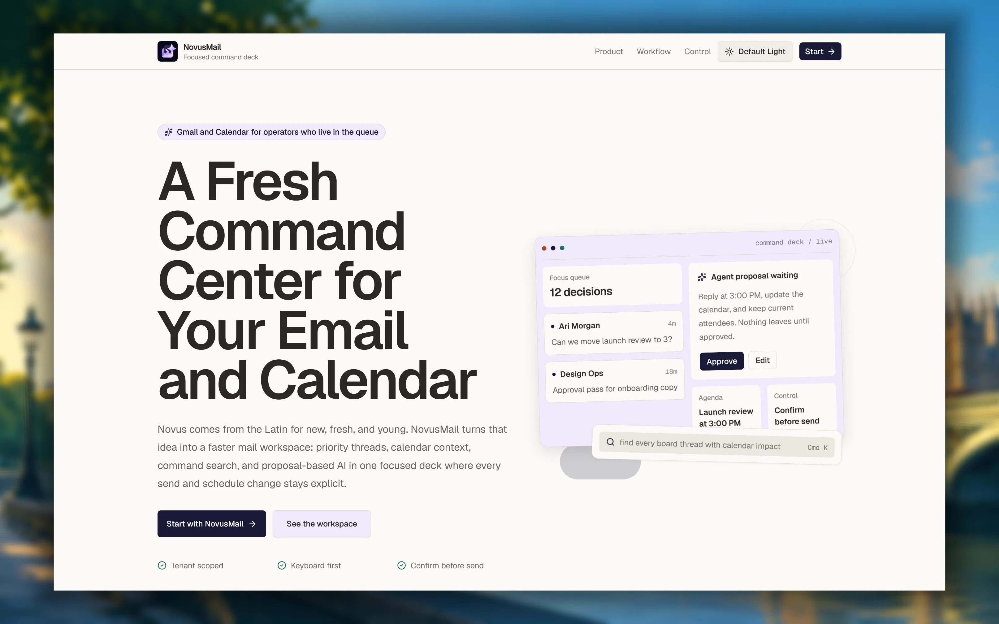
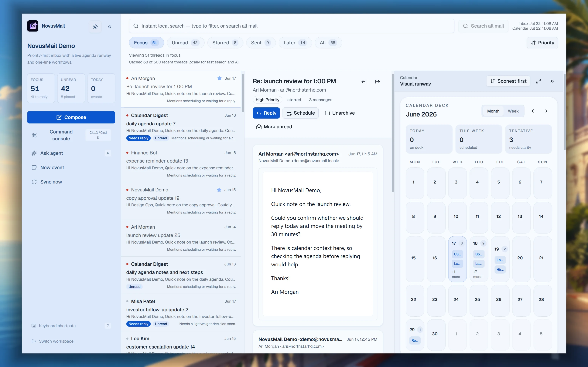
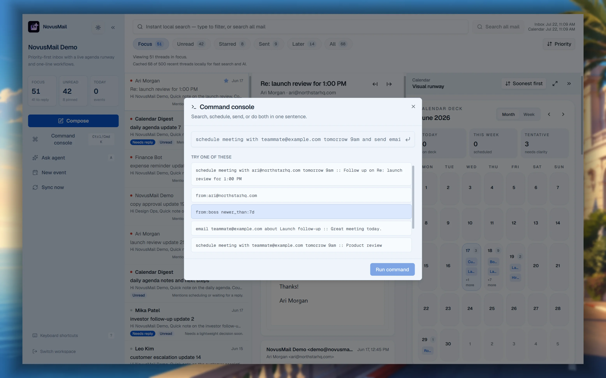
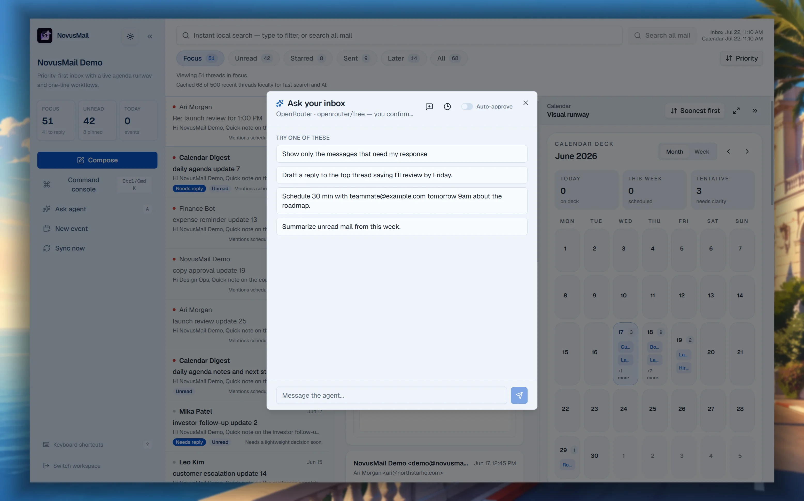
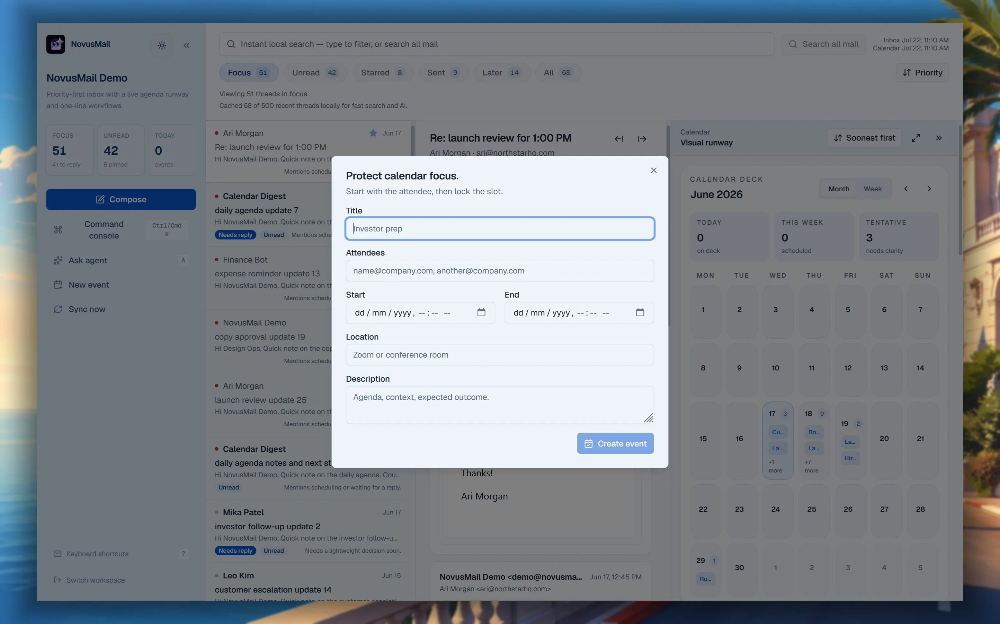
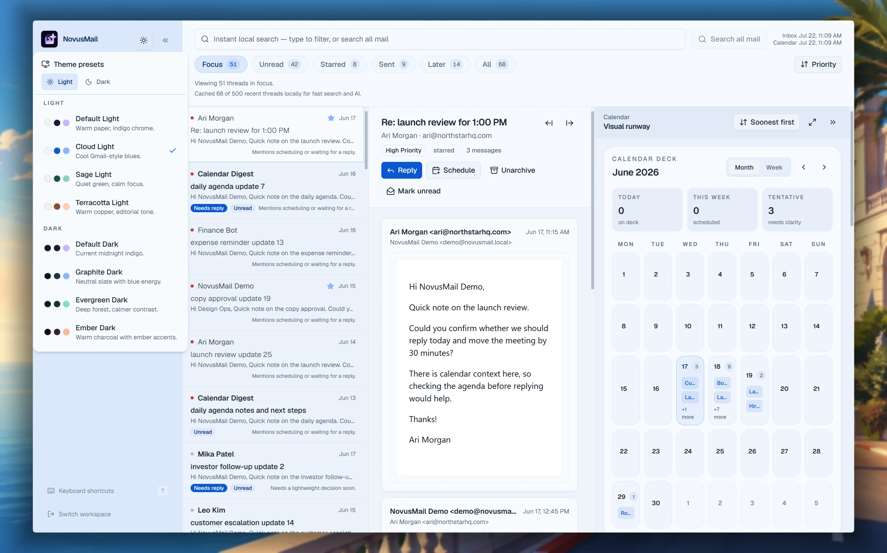

# NovusMail

**A keyboard-first workspace for Gmail and Google Calendar.** NovusMail helps people work through their inbox, manage their schedule, and use AI assistance without giving up control of important actions.

[Open the live app](https://novus.vinayrp.in) | [Watch the demo](https://cap.so/s/7mzq85nxce9der6) | [View the source](https://github.com/GhostInHex/novus-mail/)



## Why NovusMail

Email is where work arrives; calendars are where it gets committed. Switching between inboxes, scheduling tools, and AI chat windows adds friction to both. NovusMail brings those surfaces together in one focused, multi-panel workspace built for people who prefer speed, context, and keyboard control.

The product treats AI as a copilot, not an autopilot: it can search, summarize context, draft a reply, or propose a meeting, but a user explicitly confirms every email send or calendar creation.

## What you can do

- Triage Gmail with focused, unread, starred, later, and all-mail views
- Read and act on full email threads: reply, archive, star, mark read/unread, or trash
- Compose email and create or update Calendar events without leaving the workspace
- Keep the inbox, thread context, and upcoming agenda visible together
- Use a command palette to search mail, send messages, schedule meetings, or run a meeting-plus-follow-up workflow
- Ask the optional AI operator to search the inbox, read a thread, inspect the agenda, draft an email, or propose an event
- Search locally cached mail at high speed, then fall back to live Gmail for a complete search
- Receive live Gmail and Calendar updates through webhooks and server-sent events

## Product flow

1. Sign in and connect Gmail and Google Calendar.
2. Work through priority-aware inbox views alongside the day's agenda.
3. Use keyboard shortcuts, commands, or the AI operator to move quickly.
4. Review and confirm any action that sends email or changes the calendar.

## Product tour

### One workspace for the inbox and calendar

The primary workspace keeps a priority-aware message queue, the active thread, and calendar context in view at the same time.



### Command-driven workflows

The command console turns natural language and Gmail search operators into fast searches, emails, scheduled meetings, and combined follow-up workflows.



### AI assistance with user approval

The AI operator can inspect the inbox and agenda, then draft or propose work for review. Nothing is sent or scheduled without an explicit confirmation.



### Create calendar events in context

Schedule a meeting directly from the workspace without losing the email thread or calendar context that prompted it.



### Personalize the workspace

Built-in light and dark theme presets make the command deck comfortable across different working environments.



## Built for a real integration, not a mockup

NovusMail connects to live Google data through Corsair's Gmail and Google Calendar plugins. Each user gets a tenant-scoped workspace and credential set, so inbox, calendar, cache, and realtime updates remain isolated.

The app reads from a Postgres-backed synced cache first for a fast experience. Live Google API calls are used for writes and as a fallback when cached data is unavailable. Full-text search uses PostgreSQL `tsvector` and a GIN index, while webhook-triggered sync events notify the browser through SSE.

## Tech stack

| Area | Technology |
| --- | --- |
| Application | Next.js 16, React 19, TypeScript |
| Styling and UI | Tailwind CSS, Radix UI, cmdk, Lucide |
| Google integrations | Corsair, Gmail plugin, Google Calendar plugin |
| Data | PostgreSQL, Drizzle ORM |
| Search | PostgreSQL full-text search (`tsvector` + GIN) |
| Realtime | Google webhooks, Server-Sent Events, polling fallback |
| AI | Provider-neutral OpenAI-compatible chat-completions client |
| Deployment | Vercel-ready application with Neon-compatible Postgres |

## Core engineering decisions

- **Safe AI actions:** The agent has immediate access only to read tools. Draft-email and propose-event tools return a reviewable proposal; the existing validated API routes execute the confirmed action.
- **Fast, resilient data access:** Cache-first reads keep everyday inbox work responsive. Gmail refresh is used only when needed, and a remote-search option covers mail beyond the local cache.
- **Multi-tenant by design:** The signed-in email derives the workspace tenant identifier, and every Corsair call runs inside that tenant boundary.
- **Realtime with graceful degradation:** Webhooks refresh synchronized data, SSE updates active browsers, and polling remains available for serverless environments.
- **Production-aware foundations:** Health checks, rate limiting, webhook verification, duplicate-delivery protection, structured logs, and scheduled watch renewal are included.

## Repository layout

This repository has two independent projects:

- `corsair-email/` - the NovusMail product: Next.js application, self-hosted Corsair runtime, and Postgres-backed workspace.
- Root scripts - a small hosted-Corsair provisioning harness used to inspect or provision hosted development resources. It is separate from the app and its data.

Most contributors will work from `corsair-email/`.

## Run locally

Prerequisites: Node.js 20.9+, Docker, a Google OAuth client, and a PostgreSQL instance (Docker Compose supplies one locally).

```bash
cd corsair-email
npm install
docker compose up -d
```

Create the local environment file:

```powershell
Copy-Item .env.example .env.local
```

Set `CORSAIR_KEK`, `SESSION_SECRET`, `DATABASE_URL`, and `NEXT_PUBLIC_APP_URL` in `.env.local`. Add Google OAuth credentials to sign in and connect Gmail/Calendar. AI is optional; configure `AI_BASE_URL`, `AI_API_KEY`, and `AI_MODEL` only when you want the AI operator enabled.

```bash
npm run dev
```

Then open [http://localhost:3000](http://localhost:3000). For the complete OAuth, webhook, and deployment setup, see the [app README](./corsair-email/README.md) and [deployment checklist](./corsair-email/docs/deployment-checklist.md).

## Useful commands

Run these from `corsair-email/`:

```bash
npm run dev           # Start the development server
npm run typecheck     # Type-check the app
npm run test          # Run the test suite
npm run build         # Create a production build
npm run db:push       # Apply the Drizzle schema
npm run corsair:setup # Store Gmail and Calendar OAuth client credentials
```

## Demo and source

See the product in action in the [demo video](https://cap.so/s/7mzq85nxce9der6), try the [live deployment](https://novus.vinayrp.in), or explore the [GitHub repository](https://github.com/GhostInHex/novus-mail/).
